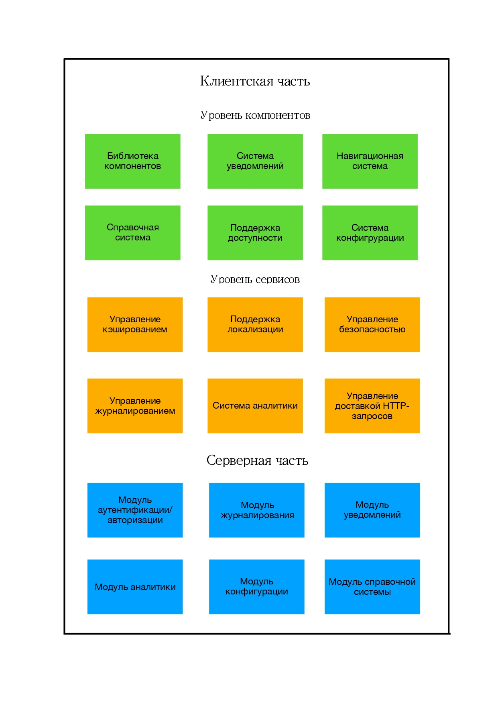

# Видение приложения с рабочим названием «Health Profile»

## Краткое описание и назначение приложения
**Health Profile** (далее **HP**) - это PWA, представляющее собой единое пространство для пользователя по контролю различных аспектов своего здоровья, а также здоровья других пользователей.

**HP** представляет собой оболочку для различных подсистем (модулей). К таким подсистемам относится ПС с рабочим названием **Nutrition**. Именно эта подсистема войдёт в состав MVP приложения **HP**.
Другие возможные подсистемы:
*  **Sleep (Сон)** - включает в себя трекер сна и аналитику сна.
*  **Body State (Состояние Организма)** - подсистема, которая хранит и генерирует статистику на основе введённых в неё данных исследований, которые прошёл пользователь (например уровень сахара за год). Вероятен функционал анализа состояния организма на основании введённых данных исследований и выдачи на основе этого анализа советов/предупреждений для пользователя (ни в коем случае не диагнозов).
*  **To See A Doctor (На Приём)** - подсистема для записи на приём к врачу (вероятно с возможностью записи через страховые компании по ДМС).

Подразумевается, что все подсистемы должны быть автономными, модульно подключаясь к приложению оболочке HP.

Более вероятный сценарий, **HP** - будет являться не приложением-оболочкой, а экосистемой. На данном этапе это не столь важно, т.к. подсистемы, входящие в **HP** будут независимыми.
## Решаемые задачи и поддерживаемые сценарии
* Доступность для пользователей с ограниченными возможностями
* Удобная система входа/регистрации
* Предоставление встроенной справочной системы
* Удобная навигация

## Функциональная архитектура
Функциональная архитектура клиентской части приложения делится на 2 уровня:
* **Уровень компонентов**. К этому уровню относится библиотека компонентов (UI-kit), а так же иные визуальные стандартизованные области приложения, обеспечивающие типовые взаимодействия в интерфейсе (например, компонент уведомлений).
* **Уровень сервисов**. Программные модули, работающие в составе **HP**, обеспечивающие выполнение нефункциональных требований - отзывчивости интерфейса, безопасности, устойчивости и т.д.

Так же выделяются серверные компоненты **HP**, представляющие функционал, необходимый для функционирования клиентского приложения.

  

В состав клиентской части **HP** входят:
* Библиотека компонентов
* Управление кэшированием
* Система уведомлений
* Навигационная система
* Поддержка локализации
* Справочная система
* Управление безопасностью
* Управление журналированием и обработкой ошибок
* Поддержка доступности
* Система аналитики
* Система конфигурации
* Управление доставкой HTTP-запросов

Серверная часть **HP** состоит из:
* Модуля аутентификации/авторизации
* Модуля журналирования
* Модуля уведомлений
* Модуля аналитики
* Модуля конфигурации
* Модуля справочной системы
* Test